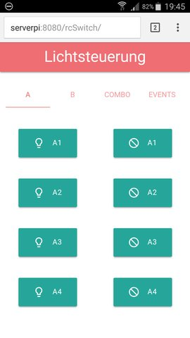
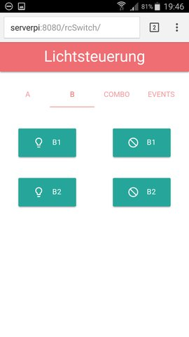
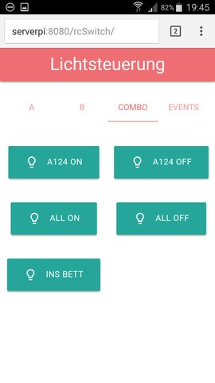
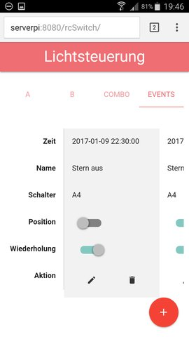
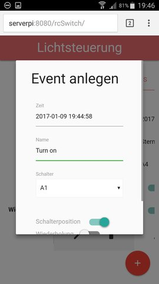
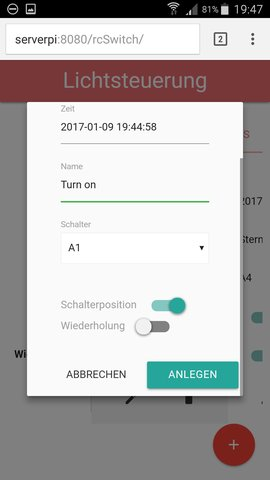
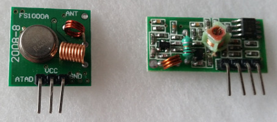
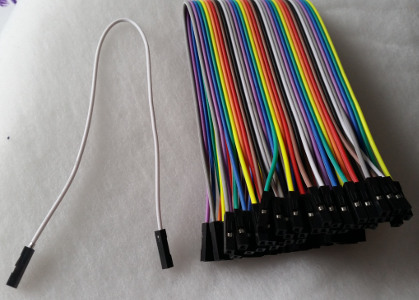

rcSwitch
========

rcSwitch is a server application that runs on a raspberry pi and lets you
switch remote controlled outlet sockets via a mobile-friendly web interface.
Additionally, you can schedule switch events for a future execution (and have
them repeated every 24 hours if desired).

Here are some screenshots of the user interface (taken on a Samsung Galaxy S5 in
Google Chrome Mobile):






 

Currently, the user interface is hard-coded in German (locale-support is planned).
Anyway, it should not be hard to understand its functionality ("Lichtsteuerung" means
"light control", "Zeit"="time", "Schalter"="switch", "Wiederholung"="repeat",
"anlegen"="create", "aktualisieren"="update").

Status
------

This project has met the minimal requirements in order
to be useful for myself. Further improvements and features are planned, see the
[Issues](https://github.com/neshanjo/rc-switch/issues) page. It is not meant
to be a ready, out-of-the-box product for immediate usage, but rather a starting
point for your own experiments and customisations. That said, it is however
quite easy to build and run the project on your raspberry pi and actually use it.

Quick Start (Test mode)
-----------------------

Make sure, you have JDK 8, [Apache Maven](https://maven.apache.org/) and 
[bower](https://bower.io/) installed on your system.

Clone the project, open a shell in the project directory and run `bower install`. 
This is only needed once to download the web frontend packages.

Now, run `mvn jetty:run` which compiles the code and starts an integrated 
jetty server on port 8080. Opening http://localhost:8080/rcSwitch in your
browser should give you the user interface. The server runs in test mode, i.e.,
instead of sending switch commands, the commands are printed to the console. This mode is
also very useful during development since all changes to the code are immediately
reloaded on the integrated server.

rcSwitch creates a directory $HOME/.rcSwitch to store the events in an
[h2](http://www.h2database.com) database.

Real Usage
----------

After you have successfully completed the quick start (see above), you can run 
rcSwitch on a raspberry pi in order to control real sockets.

You need

* a raspberry pi (any model should be fine) running raspbian jessy. To save time, you
can download the *lite* version of jessy and install the JDK 8 by 
running `sudo apt-get install oracle-java8-jdk`. If you
use the full jessy version, the JDK is already there.
* remote controlled sockets. I'm using the Brennenstuhl 1000 N Comfort set which
can be easily configured via mini switches (and, thus, keeps its configuration
even when unplugged), although a variety of different sockets should work.
* a 433 MHz RF Transmitter module (ebay or amazon is your friend). They usually 
come as transmitter and receiver pair. You only need the transmitter (shown on
the left) <br>

* three female to female connector cables (usually come as a bundle of 20) <br>


Then go to [pi4j.com](http://pi4j.com) and open the pin numbering scheme for
your raspberry pi model (link in the left column). Use the female to female
cables to connect GPIO 0 on the raspberry with ATAD on the transmitter, 
5.0 VDC with VCC and GROUND with GND. You can improve the operating distance
by soldering a cable to the ANT connector on the transmitter (I read in some
forum that it should be straight and 17 centimeters long).

To run the app on the raspberry, I recommend using an application server. First, 
build a war file by running `mvn clean install`. Copy the generated target/rcSwitch.war
to the raspberry pi. I'm using the current 8.5.x version of 
[Apache Tomcat](https://tomcat.apache.org/download-80.cgi), since this is the 
server I'm most familiar with. Probably, any other application server should work as well.
Download the latest 8.5.x release to the raspberry, unzip it, put the rcSwitch.war into the folder
webapps and run bin/startup.sh. Watch logs/catalina.out for any errors.

Configuration
-------------

To customize the buttons in the UI and the corresponding switch codes, have a look 
at src/main/resources/configuration.json which should be mainly self-explanatory. 
Three points are explained in more detail:

1. The group corresponds to the mini-switch setting on the receiver. 11000 means that the first and
second switch are in the upper position, while switches 3 to 5 are in the lower position.
1. The code is the letter of the the socket, where A=1, B=2 and so on.
1. In order to start the background thread used for scheduling(see Events tab in the UI),
currently a workaround is needed: When the application is started, a GET request must be
sent to APPLICATION_PATH/api/wakeup. This url must be adapted if you change the server port or webapp path
(configuration parameter backgroundTaskWakeupUrl). Have a look at logs/catalina.out when you started the Tomcat
server in order to see this process happen.

Experimental Features
---------------------
The service can poll an [AWS SQS](https://aws.amazon.com/sqs/) queue for switch events. Therefore, you have to create
a queue with long polling of 20s and add a user with following policy (in AWS IAM):
```
{
 "Version": "2012-10-17",
 "Statement": [
     {
         "Sid": "VisualEditor0",
         "Effect": "Allow",
         "Action": [
             "sqs:DeleteMessage",
             "sqs:ReceiveMessage"
         ],
         "Resource": "<insert your arn here, e.g. arn:aws:sqs:<region>:<number>:<name>"
     }
 ]
}
``` 
Then, you add the following to the configuration file:
```
"sqs": {
        "accessKey": "A...",
        "secretKey": "B...",
        "queueUrl": "https://sqs.<region>.amazonaws.com/..."
    }
```
This starts a background task which listens to queue events where the following *message attributes* are present (the
message body is ignored): `switchName` as one of the names of the switches from the config file and `position` being
either *on* or *off*. 

Technology
----------

This project uses the following technologies/frameworks:

* [Jersey](https://jersey.java.net/), [EclipseLink JPA](http://www.eclipse.org/eclipselink/), 
[h2 database](http://www.h2database.com) for the REST server (also have a look at [Project Lombok](https://projectlombok.org/)
if you haven't used it yet).
* [pi-RC-Switch](https://github.com/entrusc/Pi-RC-Switch) (source file copied to this project) 
and [pi4j](http://pi4j.com) for dealing with the IO-Pins and the RF transmitter.
* [Vue.js](https://vuejs.org/), [Materialize](http://materializecss.com), [jQuery](https://jquery.com/)
and [Moment.js](http://momentjs.com/) for the frontend.
* [AWS SDK](https://aws.amazon.com/sdk-for-java/) for the experimental AWS SQS integration.

Questions?
----------

Feel free to send me a mail (`java@neshanjo.de`) or create an issue in github.

License
-------
The license is [LGPL v3](http://www.gnu.org/licenses/lgpl.html), see `LICENSE` for details.